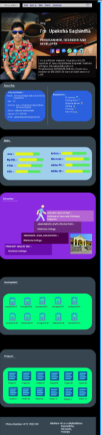

<h1 style="text-align: center">This is My Profile</h1>
 

 I’m  Upeksha Sachintha .I am a software engineer .Education at IJSE (Institute of Java and Software Enginner) Institute of Higher Education.Education in 
 Programming,OOP,DBMS,Web etc.Course as a member of the GDSE 58 team at Galle branch of IJSE.
 

 <ul>
<li style="font-size: 20px"><b>Site Map URL</b> :- <a href="https://www.gloomaps.com/ErzJGbGMdM" target="_blank">https://www.gloomaps.com/pXmsmrHeFZ</a></li>
  
 <li style="font-size: 20px"><b>Wireframe URL Of My Profile</b> :- <a href="https://wireframe.cc/gzpcW7" target="_blank">https://wireframe.cc/iVep1K</a></li>
  
 <li style="font-size: 20px"><b>Mockup URL of My Profile designed by figma</b> :- <a href="https://www.figma.com/file/i9QFNhyyuGIzQNzAuFmqz3/My-Profile?node-id=0%3A1" target="_blank">https://www.figma.com/file/ooJCjOQp25zr4At6LmkXCH/MyProfile?node-id=0%3A1</a></li>
  
 <li style="font-size: 20px"><b>Github My Profile Page URL</b> :- <a href="https://upeksha1214.github.io/MyProfile/" target="_blank">https://upeksha1214.github.io/MyProfile/</a></li>
  
 <li style="font-size: 20px"><b>000WebHost URL</b> :- <a href="" target="_blank">/</a></li>
 </ul>
 

